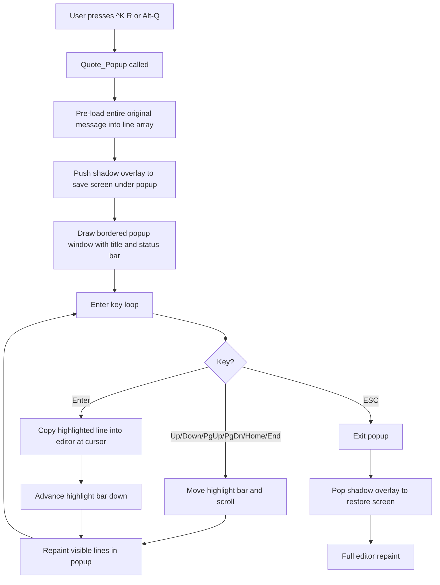

# Quote Window Redesign — Mystic BBS-style Popup

## Problem Statement

The existing MagnEt quoting system in [`med_quot.c`](src/max/msg/med_quot.c) is broken: it renders only AVATAR attribute characters instead of readable quoted text. The root cause is that the old code splits the screen vertically — stealing `QUOTELINES` (4) rows from `usrlen` — and renders quote text inline using `LangPrintfForce()` with format strings that assume specific column/attribute behavior. The AVATAR attribute bytes leak through as visible garbage.

The entire quoting model is tightly coupled to the inline split-screen approach: [`Quote_OnOff()`](src/max/msg/med_quot.c:39) shrinks `usrlen`, [`Quote_Read()`](src/max/msg/med_quot.c:145) renders directly into those rows, and [`Quote_Copy()`](src/max/msg/med_quot.c:237) bulk-copies all 4 visible lines at once. Patching the rendering alone won't fix the UX — the 4-line window is too small and the bulk-copy is clunky.

## Design Goal

Replace the broken inline quoting with a **Mystic BBS-style popup quote window**: a bordered overlay at the bottom of the screen with a highlight bar, single-line accept via Enter, and full scrolling. The editor area underneath is untouched and fully repainted on close.

## Architecture Overview



## Design Decisions

### 1. Pre-load entire message vs. chunked reading

**Decision: Pre-load entire message.**

The existing chunked approach via `MsgSetCurPos`/`Msg_Read_Lines` with `quote_pos[]` bookkeeping is fragile and causes the rendering bugs. Pre-loading into a simple `char **` line array:
- Eliminates all `quote_pos[]` / `cur_quotebuf` / `last_quote` state
- Makes scrolling trivial (just index arithmetic)
- Memory cost is bounded: FidoNet messages max ~16 KB; even 500 lines × 160 bytes = 80 KB — negligible

### 2. Use modern display primitives vs. raw Goto/Printf

**Decision: Use `ui_shadowbuf_t` for overlay save/restore, but render popup content with direct `Goto`/`Puts`/attribute emission.**

Rationale:
- [`ui_shadowbuf_overlay_push()`](src/max/display/ui_shadowbuf.h:190) / [`ui_shadowbuf_overlay_pop()`](src/max/display/ui_shadowbuf.h:195) give us clean screen save/restore — critical for leaving the editor undamaged
- The popup interior is simple enough (border + N lines + status) that direct `Goto`/`Puts` is clearer and avoids adding a dependency on `ui_scrolling_region_t` which expects its own internal shadow buffer
- Attribute control via `EMIT_MSG_TEXT_COL()` macro and direct `\x16\x01\xNN` sequences, consistent with existing MagnEt code

### 3. ^Q keybinding conflict

**Decision: Repurpose ^Q as quote-window toggle.**

Currently [`Process_Control_Q()`](src/max/msg/maxed.c:655) is a WordStar prefix for `^QS` (home), `^QD` (end), `^QY` (delete to EOL). These are already available as:
- `^QS` → Home key / [`Cursor_BeginLine()`](src/max/msg/maxedp.h:51)
- `^QD` → End key / [`Cursor_EndLine()`](src/max/msg/maxedp.h:52)
- `^QY` → no direct equivalent, but rarely used

Plan: `^Q` alone (no second key within 200ms, or immediately if no reply context) opens the quote popup. `^QS`/`^QD`/`^QY` continue working — the popup only activates when the second key is NOT S/D/Y. Alternatively, simply map the popup to `^KR` (existing binding at [maxed.c:748](src/max/msg/maxed.c:748)) and `Alt-Q` (scan code 16, existing at [maxed.c:508](src/max/msg/maxed.c:508)), and leave `^Q` prefix alone.

**Recommended approach:** Keep `^Q` prefix behavior unchanged. Map quote popup to `^KR` (existing) and `Alt-Q` (existing scan 16). Add ESC as exit-only inside the popup.

### 4. Keep Alt-C bulk copy or just Enter line-by-line

**Decision: Enter for single-line copy only; drop Alt-C bulk copy.**

The old `Alt-C` / `^KC` called [`Quote_Copy()`](src/max/msg/med_quot.c:237) which bulk-copied all 4 visible `QUOTELINES`. With the new popup, Enter copies the highlighted line and auto-advances the highlight — this is the standard Mystic/WWIV/RemoteAccess pattern. Bulk copy is unnecessary and confusing with a highlight bar. `Alt-C` / `^KC` bindings become no-ops (or could be repurposed later).

## Screen Layout

```
┌─────────────────────────────────────────────────────────────────────────────┐
│ ... editor text lines (rows 1 through usrlen-1) ...                        │
│ [MagnEt status bar]                                          row = usrlen  │
├─[ Quote Window ]────────────────────────────────────────────────────────────┤ row = usrlen - QW_HEIGHT
│  km> This is the original message line 1                                   │
│  km> And here is line 2                                                    │
│▌ km> This line is highlighted ◄━━ highlight bar                           ▌│
│  km> More text from the original                                           │
│  km> Even more text here                                                   │
│  km> And the last visible line                                             │
│  km> Continued...                                                          │
│  km> Still going...                                                        │
├─────────────────────────────────────────────────────────────────────────────┤
│ ^Q/ESC=End | CR=Accept | Up/Down/PgUp/PgDn/Home/End=Scroll                │
└─────────────────────────────────────────────────────────────────────────────┘ row = TermLength
```

### Dimensions

| Element | Value |
|---------|-------|
| `QW_BORDER_TOP` | 1 row (title bar with box-drawing) |
| `QW_CONTENT` | `min(8, TermLength - usrlen - 3)` rows of quote lines |
| `QW_BORDER_BOT` | 1 row (bottom border) |
| `QW_STATUS` | 1 row (key help) |
| `QW_HEIGHT` | `QW_BORDER_TOP + QW_CONTENT + QW_BORDER_BOT + QW_STATUS` |
| Top row | `TermLength - QW_HEIGHT + 1` |
| Content width | `usrwidth - 2` (inside left/right border chars) |

Box-drawing uses CP437 single-line: `┌─┐│└─┘` (chars `0xDA 0xC4 0xBF 0xB3 0xC0 0xC4 0xD9`). Falls back to `+-+|+-+` if `BITS2_IBMCHARS` is not set.

## Data Structures

### New: `quote_popup_t` (in new file `med_qpop.c`, declared in `maxedp.h`)

```c
/**
 * @brief State for the popup quote window.
 */
typedef struct quote_popup
{
    char **lines;           /**< Array of pre-loaded, prefix-formatted lines */
    int    line_count;      /**< Total number of lines in the message */
    int    view_top;        /**< Index of topmost visible line */
    int    highlight;       /**< Index of currently highlighted line */
    int    content_height;  /**< Number of visible content rows */
    int    content_width;   /**< Visible width inside borders */
    int    top_row;         /**< Screen row of top border */
    char   initials[MAX_INITIALS]; /**< Sender initials for prefix */
    ui_shadowbuf_t screen_save;    /**< Shadow buffer for overlay save/restore */
    ui_shadow_overlay_t overlay;   /**< Overlay state for push/pop */
} quote_popup_t;
```

### Removed globals (from [`maxed.h`](src/max/msg/maxed.h))

These become unnecessary and should be removed or left as dead code initially:

| Global | Reason |
|--------|--------|
| `cur_quotebuf` | Replaced by `quote_popup_t.view_top` |
| `last_quote` | Replaced by `quote_popup_t.line_count` |
| `quotebuf` | Replaced by `quote_popup_t.lines` |
| `quote_pos` | Eliminated — no chunked seeking |
| `quoting` | Replaced by popup being modal — no persistent state |

The `initials[]` global and `qmh` handle remain needed during pre-load but not during the popup loop.

## Function Signatures

### New functions (in `med_qpop.c`)

```c
/**
 * @brief Open the quote popup window. Modal — returns when user exits.
 *
 * @param pr  Reply context (message area + original UID).
 * @return Number of lines inserted into the editor, or 0 if cancelled.
 */
int Quote_Popup(struct _replyp *pr);

/**
 * @brief Pre-load the entire original message into a line array.
 *
 * Each line is formatted with the quote prefix: " xx> text".
 * Kludge lines and SEEN-BY are filtered per user privilege.
 *
 * @param pr         Reply context.
 * @param initials   Output: parsed sender initials.
 * @param out_lines  Output: allocated array of line strings.
 * @param out_count  Output: number of lines.
 * @return 1 on success, 0 on failure.
 */
static int near Quote_PreloadMessage(struct _replyp *pr, char *initials,
                                     char ***out_lines, int *out_count);

/**
 * @brief Free the pre-loaded line array.
 */
static void near Quote_FreeLines(char **lines, int count);

/**
 * @brief Draw the popup border, title, and status bar.
 */
static void near Quote_DrawFrame(const quote_popup_t *qp);

/**
 * @brief Redraw visible content lines with highlight bar.
 */
static void near Quote_DrawContent(const quote_popup_t *qp);

/**
 * @brief Draw a single content row (used for incremental highlight updates).
 *
 * @param qp    Popup state.
 * @param idx   Line index in qp->lines[].
 * @param highlighted  Whether to draw with highlight attribute.
 */
static void near Quote_DrawLine(const quote_popup_t *qp, int idx, int highlighted);

/**
 * @brief Insert one quoted line into the editor buffer at cursor position.
 *
 * Reuses the existing line allocation/insertion logic from Quote_Copy().
 *
 * @param line  The formatted quote line (already has prefix).
 * @return 1 on success, 0 if editor is full.
 */
static int near Quote_InsertLine(const char *line);

/**
 * @brief Clamp view_top so highlight is visible.
 */
static void near Quote_EnsureVisible(quote_popup_t *qp);

/**
 * @brief Run the popup key loop.
 *
 * @return Number of lines inserted.
 */
static int near Quote_KeyLoop(quote_popup_t *qp);
```

### Modified functions

| Function | File | Change |
|----------|------|--------|
| [`Quote_OnOff()`](src/max/msg/med_quot.c:39) | `med_quot.c` | Gutted. Now just calls `Quote_Popup(pr)` and returns. |
| [`Quote_Copy()`](src/max/msg/med_quot.c:237) | `med_quot.c` | Removed or made no-op. |
| [`Quote_Up()`](src/max/msg/med_quot.c:116) | `med_quot.c` | Removed or made no-op. |
| [`Quote_Down()`](src/max/msg/med_quot.c:129) | `med_quot.c` | Removed or made no-op. |
| [`Redraw_Quote()`](src/max/msg/med_scrn.c:76) | `med_scrn.c` | Becomes empty — popup is modal, no persistent quote region. |
| [`Process_Scan_Code()`](src/max/msg/maxed.c:494) | `maxed.c` | Scan 46 (Alt-C) becomes no-op. Scan 16 (Alt-Q) calls `Quote_Popup()` directly. |
| [`Process_Control_K()`](src/max/msg/maxed.c:702) | `maxed.c` | `^KC` becomes no-op. `^KR` calls `Quote_Popup()` directly. |
| [`MagnEt()`](src/max/msg/maxed.c:90) | `maxed.c` | Remove `quotebuf` and `quote_pos` malloc/free. Remove `quoting` checks at exit. |

### Unchanged functions

- [`Parse_Initials()`](src/max/msg/m_edit.c:102) — reused as-is
- [`QuoteThisLine()`](src/max/msg/m_edit.c:131) — reused in pre-load to decide prefix format
- [`Msg_Read_Lines()`](src/max/msg/med_quot.c:172) — reused in pre-load loop
- [`Fix_MagnEt()`](src/max/msg/med_scrn.c:414) — called after popup closes for full repaint

## Key Bindings

### Inside the popup (modal key loop)

| Key | Action |
|-----|--------|
| Up / `^E` | Move highlight up one line |
| Down / `^X` | Move highlight down one line |
| PgUp / `^R` | Scroll up one page |
| PgDn / `^C` | Scroll down one page |
| Home | Jump to first line |
| End | Jump to last line |
| Enter | Copy highlighted line to editor, advance highlight |
| ESC | Close popup, return to editor |
| `^Q` | Close popup, return to editor (alias for ESC) |

### In the editor (unchanged except popup trigger)

| Key | Current | New |
|-----|---------|-----|
| Alt-Q (scan 16) | `Quote_OnOff(pr)` toggle | `Quote_Popup(pr)` one-shot |
| `^KR` | `Quote_OnOff(pr)` toggle | `Quote_Popup(pr)` one-shot |
| Alt-C (scan 46) | `Quote_Copy()` if quoting | No-op |
| `^KC` | `Quote_Copy()` if quoting | No-op |

## Color Attributes

| Element | PC Attribute | Description |
|---------|-------------|-------------|
| Border | `0x1F` | Bright white on blue |
| Title text | `0x1E` | Yellow on blue |
| Normal line | `0x17` | White on blue |
| Highlight bar | `0x70` | Black on white (inverse) |
| Quote prefix | `0x1B` | Bright cyan on blue |
| Status bar | `0x30` | Black on cyan |

These should be defined as `#define QW_ATTR_*` constants in `med_qpop.c` for easy tuning.

## Implementation Steps

### Phase 1: New popup file and pre-loader

1. Create [`med_qpop.c`](src/max/msg/med_qpop.c) with the `quote_popup_t` struct and `Quote_PreloadMessage()` / `Quote_FreeLines()` functions
2. Pre-load reads the message via `MsgOpenMsg()` / `Msg_Read_Lines()` loop, calls `Parse_Initials()` for prefix, formats each line as `" xx> text"` using `QuoteThisLine()`, stores into a `malloc`'d `char **`
3. Add `med_qpop.c` to the Makefile in `src/max/msg/`

### Phase 2: Popup frame and content rendering

4. Implement `Quote_DrawFrame()` — border drawing with box chars, title `[ Quote Window ]`, status bar text
5. Implement `Quote_DrawContent()` and `Quote_DrawLine()` — render visible lines with highlight bar attribute swapping
6. Implement `Quote_EnsureVisible()` — clamp `view_top` so `highlight` is always in the visible range

### Phase 3: Overlay save/restore

7. In `Quote_Popup()`, initialize a `ui_shadowbuf_t` matching terminal dimensions, use `ui_shadowbuf_overlay_push()` to snapshot the popup region before drawing
8. On exit, call `ui_shadowbuf_overlay_pop()` and then `Fix_MagnEt()` for a full editor repaint

### Phase 4: Key loop and line insertion

9. Implement `Quote_KeyLoop()` — reads keys via `Mdm_getcwcc()`, dispatches Up/Down/PgUp/PgDn/Home/End/Enter/ESC
10. Implement `Quote_InsertLine()` — allocates a line in the editor's `screen[]` array, shifts lines down, copies the quoted text with `HARD_CR` prefix, updates `num_lines` / `cursor_x`
11. Handle ANSI cursor key sequences (ESC `[` A/B/5~/6~/1~/4~) matching the existing [`Process_Cursor_Key()`](src/max/msg/maxed.c:585) patterns

### Phase 5: Wire into editor

12. Gut [`Quote_OnOff()`](src/max/msg/med_quot.c:39) to just call `Quote_Popup(pr)` and return
13. Make [`Quote_Copy()`](src/max/msg/med_quot.c:237), [`Quote_Up()`](src/max/msg/med_quot.c:116), [`Quote_Down()`](src/max/msg/med_quot.c:129) into empty stubs
14. Make [`Redraw_Quote()`](src/max/msg/med_scrn.c:76) an empty function
15. In [`MagnEt()`](src/max/msg/maxed.c:90), remove `quotebuf`/`quote_pos` allocation and the `quoting` close-on-exit logic
16. Update `Process_Scan_Code()` scan 46 to no-op, scan 16 to call `Quote_Popup()`
17. Update `Process_Control_K()` 'C' to no-op, 'R' to call `Quote_Popup()`

### Phase 6: Cleanup

18. Remove dead globals from [`maxed.h`](src/max/msg/maxed.h): `cur_quotebuf`, `last_quote`, `quotebuf`, `quote_pos`, `quoting`, `qmh`
19. Add `Quote_Popup()` declaration to [`maxedp.h`](src/max/msg/maxedp.h)
20. Remove old `Quote_Up`, `Quote_Down`, `Quote_Copy` declarations from `maxedp.h`
21. Build and test: `make build && make install`

## Files to Create

| File | Purpose |
|------|---------|
| `src/max/msg/med_qpop.c` | Popup quote window implementation |

## Files to Modify

| File | Changes |
|------|---------|
| [`src/max/msg/med_quot.c`](src/max/msg/med_quot.c) | Gut `Quote_OnOff()`, stub out `Quote_Copy/Up/Down` |
| [`src/max/msg/maxed.c`](src/max/msg/maxed.c) | Remove `quotebuf`/`quote_pos` alloc, update key dispatch |
| [`src/max/msg/maxed.h`](src/max/msg/maxed.h) | Remove dead quoting globals |
| [`src/max/msg/maxedp.h`](src/max/msg/maxedp.h) | Add `Quote_Popup()`, remove old quote function decls |
| [`src/max/msg/med_scrn.c`](src/max/msg/med_scrn.c) | Empty out `Redraw_Quote()` |
| `src/max/msg/Makefile` (or parent) | Add `med_qpop.o` to object list |

## Risk Notes

- **`ui_shadowbuf_t` requires terminal dimensions at init time** — `TermWidth()` / `TermLength()` are already available in the editor context; no issue.
- **Remote users on slow connections** — the popup is small (10-12 rows), so repaint is fast. Full editor repaint on close may flash but is acceptable and consistent with existing `Fix_MagnEt()` behavior.
- **Messages with embedded ANSI** — `Quote_PreloadMessage()` should strip or pass through ANSI; since we're rendering with direct `Goto`/`Puts` and PC attributes, embedded ANSI could interfere. Recommendation: strip sequences during pre-load, keeping only plain text + quote prefix.
- **Editor line insertion** — `Quote_InsertLine()` must respect `max_lines` and handle the `EdMemOvfl()` path. Directly reuse the allocation pattern from the existing [`Quote_Copy()`](src/max/msg/med_quot.c:237).
